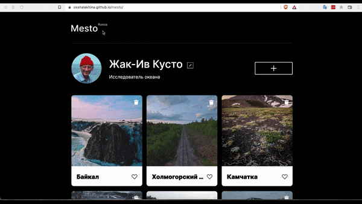
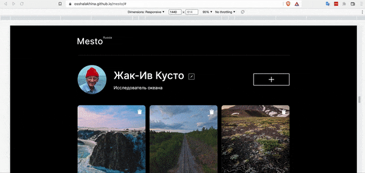

------
# Project 4: Mesto (sprint 4-5)

### About project:

Mesto service: an interactive page where you can exchange photos and put likes, change data.

### Sprint 4, implemented:

Layout:
* added profile editing popup
* overflow of content in the block is provided

JavaScript:
* popup opening and closing implemented
* form fields are filled with values that are displayed on the page
* implemented editing of the name and information about yourself

### Sprint 5, implemented:

JavaScript:
* displaying 6 cards
* implemented opening and closing popups
* adding a new card via popup
* remove cards
* popup for viewing pictures in big size from the card

### Sprint 6, implemented:

JavaScript:
* Validation of the "Edit Profile" form
* Validation of the "New location" form
* Close the popup by clicking on the overlay
* Close the popup by pressing Esc

### Tehnology: 

* HTML
* CSS
* JavaScript
* Methodology BEM
* Nested BEM
* Git

### Figma

* [For sprint 4](https://www.figma.com/file/2cn9N9jSkmxD84oJik7xL7/JavaScript.-Sprint-4?node-id=0%3A1)
* [For sprint 5](https://www.figma.com/file/bjyvbKKJN2naO0ucURl2Z0/JavaScript.-Sprint-5?node-id=0%3A1)
* [For sprint 6](https://www.figma.com/file/kRVLKwYG3d1HGLvh7JFWRT/JavaScript.-Sprint-6?node-id=1124%3A73)

Optimization of images was done through [https://tinypng.com/](https://tinypng.com/).

Code validation verified with [https://validator.w3.org/](https://validator.w3.org/).

Color converter [https://colorscheme.ru](https://colorscheme.ru/color-converter.html)

### Link on project: 

[https://osshalakhina.github.io/mesto/](https://osshalakhina.github.io/mesto/)

# Preview

* in general

* in different sizes

